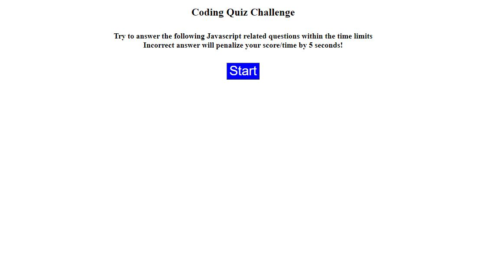
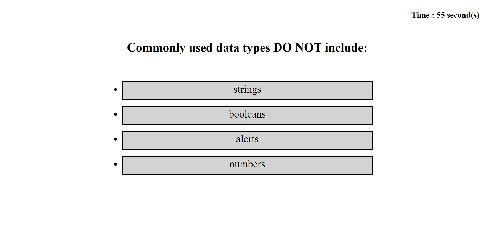
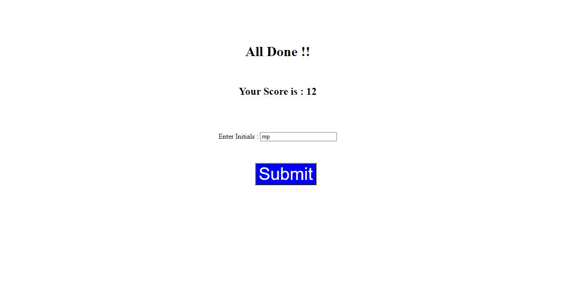
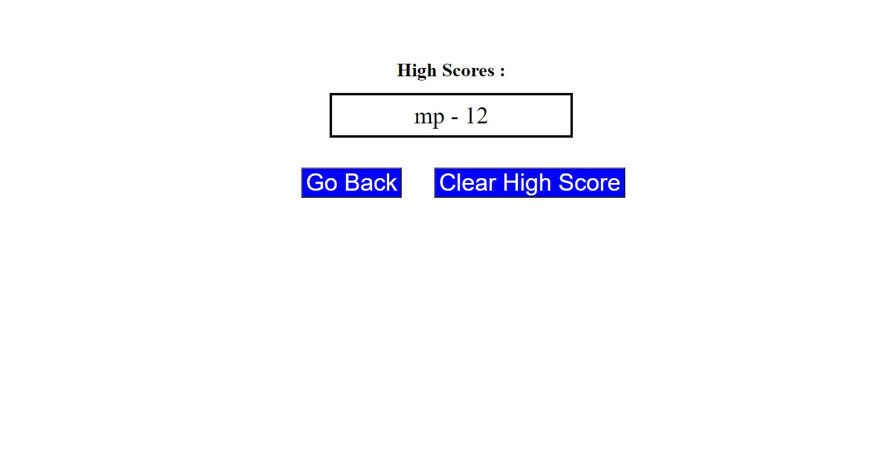

### Timer-Quiz

Client requested to create Quiz with Timer on it that meets minumum requirements in order to execute for students. 

* Minimum requirements are as below  : 

1. Clicking the start button will start timer and present with a question
1. While student answer a question, it will present another question
1. When answered incorrectly, it will show incorrect and the bottom of choices and the timer will subtract 5 seconds from remaining time.
1. When all questions are answred or timer reach to 0 second, it will take it to the score page
1. On the score page, user can put initials and submit for the scores to be saved on next step
1. On final Page user can either press Go Back button to return to start page or clear saved score.

Reference Note : 
 * The initial code was provided by and instructor which needed to improve upon.
 * The multiple choice questions were taken from : http://mcqspdfs.blogspot.com/2013/08/60-top-javascript-multiple-choice.html  

###### Below is the screenshot of the outcome when ran accordingly  

## Screenshots of the Project outcome ## 

[Please click here to deploy application](https://miraj00.github.io/Timer-Quiz/)

